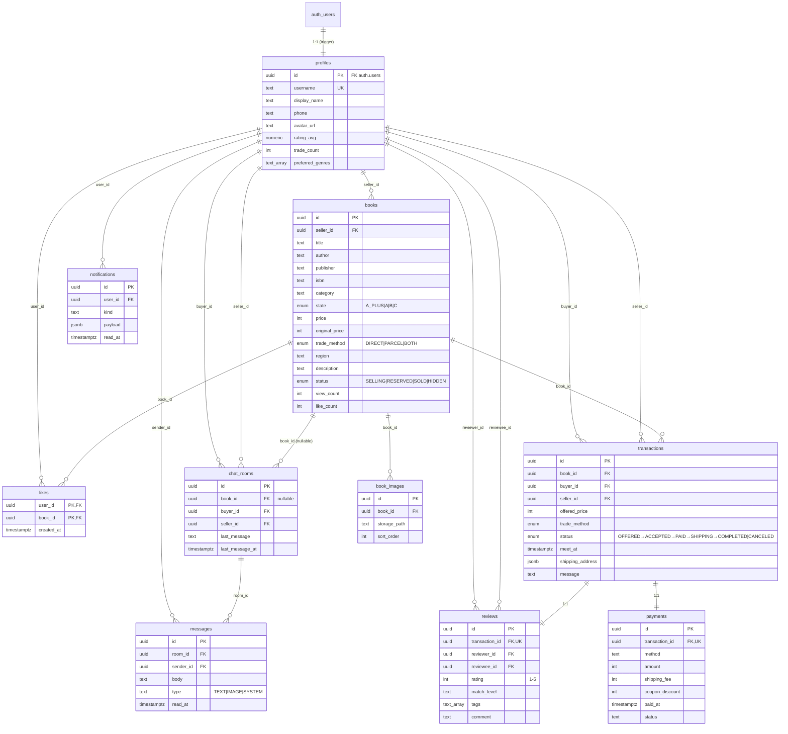

# EmptyBook (책장비움) — 데이터베이스 ERD

> 기준 파일: [`supabase/migrations/0001_init.sql`](./supabase/migrations/0001_init.sql)
> 최종 업데이트: 2026-04-23

## 1. Mermaid ERD

GitHub / Notion / VSCode 등에서 자동 렌더링된다.



## 2. 관계 요약 표

| From | → | To | 관계 | FK / 키 | 비고 |
|---|---|---|---|---|---|
| `auth.users` | → | `profiles` | 1:1 | `profiles.id` | `on_auth_user_created` 트리거가 자동 생성 |
| `profiles` | → | `books` | 1:N | `books.seller_id` | 판매자 |
| `books` | → | `book_images` | 1:N | `book_images.book_id` | `sort_order`로 정렬 |
| `profiles` ↔ `books` |  |  | N:M | `likes(user_id, book_id)` | 복합 PK |
| `books` | → | `transactions` | 1:N | `transactions.book_id` | `on delete restrict` (이력 보존) |
| `profiles` | → | `transactions` | 1:N × 2 | `buyer_id`, `seller_id` | 두 개의 FK |
| `transactions` | → | `payments` | 1:1 | `payments.transaction_id` UNIQUE | 결제 |
| `transactions` | → | `reviews` | 1:1 | `reviews.transaction_id` UNIQUE | 거래 1건당 후기 1개 |
| `profiles` | → | `reviews` | 1:N × 2 | `reviewer_id`, `reviewee_id` | 작성자 / 대상자 |
| `books` | → | `chat_rooms` | 1:N | `chat_rooms.book_id` | nullable, `on delete set null` |
| `profiles` | → | `chat_rooms` | 1:N × 2 | `buyer_id`, `seller_id` | `UNIQUE(book_id, buyer_id, seller_id)` |
| `chat_rooms` | → | `messages` | 1:N | `messages.room_id` | Realtime 구독 |
| `profiles` | → | `messages` | 1:N | `sender_id` |  |
| `profiles` | → | `notifications` | 1:N | `user_id` | Realtime 구독 |

## 3. Enum 타입

| Enum | 값 |
|---|---|
| `book_state` | `A_PLUS`, `A`, `B`, `C` |
| `trade_method` | `DIRECT`, `PARCEL`, `BOTH` |
| `book_status` | `SELLING`, `RESERVED`, `SOLD`, `HIDDEN` |
| `tx_status` | `OFFERED` → `ACCEPTED` → `PAID` → `SHIPPING` → `COMPLETED` / `CANCELED` |

## 4. 부가 사항

- **Realtime 구독 테이블**: `messages`, `chat_rooms`, `notifications`
- **Storage 버킷**: `book-images` (public read, 인증 사용자 upload)
- **RLS**: 전 테이블 활성화
  - `profiles` / `books` / `book_images` / `reviews` — public read
  - `likes` / `notifications` — 본인만
  - `transactions` / `payments` / `chat_rooms` / `messages` — 거래 당사자(buyer·seller)만

## 5. 이미지로 추출하려면

```bash
# mermaid-cli 설치 후
npx -p @mermaid-js/mermaid-cli mmdc -i ERD.md -o ERD.png
```

또는 [Mermaid Live Editor](https://mermaid.live)에 위 ` ```mermaid ` 블록을 붙여넣으면 PNG/SVG로 내보낼 수 있다.
