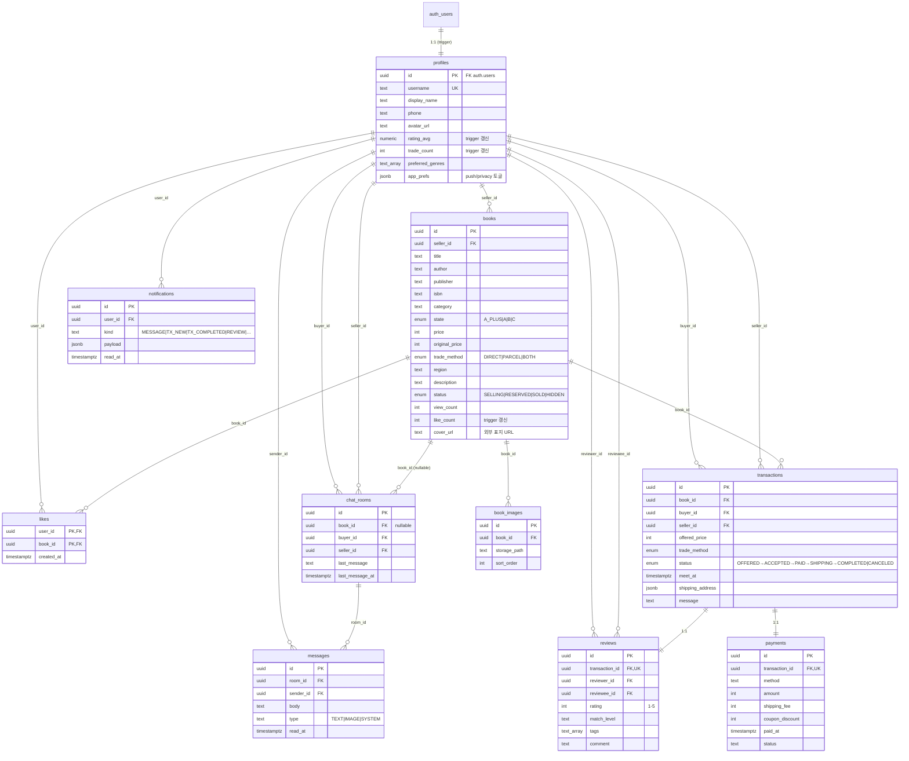

# EmptyBook (책장비움) — 데이터베이스 ERD

> 기준 마이그레이션: [`supabase/migrations/0001_init.sql`](./supabase/migrations/0001_init.sql) ~ [`0008_anonymize_notification_names.sql`](./supabase/migrations/0008_anonymize_notification_names.sql)
> 최종 업데이트: 2026-04-30 (v2)

## 1. Mermaid ERD

GitHub / Notion / VSCode 등에서 자동 렌더링된다.



## 2. 관계 요약 표

| From | → | To | 관계 | FK / 키 | 비고 |
|---|---|---|---|---|---|
| `auth.users` | → | `profiles` | 1:1 | `profiles.id` | `on_auth_user_created` 트리거가 자동 생성 |
| `profiles` | → | `books` | 1:N | `books.seller_id` | 판매자 |
| `books` | → | `book_images` | 1:N | `book_images.book_id` | `sort_order`로 정렬 (사용자 업로드 사진) |
| `profiles` ↔ `books` |  |  | N:M | `likes(user_id, book_id)` | 복합 PK + 카운트 트리거 |
| `books` | → | `transactions` | 1:N | `transactions.book_id` | `on delete restrict` (이력 보존) |
| `profiles` | → | `transactions` | 1:N × 2 | `buyer_id`, `seller_id` | 두 개의 FK |
| `transactions` | → | `payments` | 1:1 | `payments.transaction_id` UNIQUE | 결제 |
| `transactions` | → | `reviews` | 1:1 | `reviews.transaction_id` UNIQUE | 거래 1건당 후기 1개 |
| `profiles` | → | `reviews` | 1:N × 2 | `reviewer_id`, `reviewee_id` | 작성자 / 대상자 |
| `books` | → | `chat_rooms` | 1:N | `chat_rooms.book_id` | nullable, `on delete set null` |
| `profiles` | → | `chat_rooms` | 1:N × 2 | `buyer_id`, `seller_id` | `UNIQUE(book_id, buyer_id, seller_id)` |
| `chat_rooms` | → | `messages` | 1:N | `messages.room_id` | Realtime 구독 |
| `profiles` | → | `messages` | 1:N | `sender_id` |  |
| `profiles` | → | `notifications` | 1:N | `user_id` | Realtime 구독, 트리거가 자동 INSERT |

## 3. Enum 타입

| Enum | 값 |
|---|---|
| `book_state` | `A_PLUS`, `A`, `B`, `C` |
| `trade_method` | `DIRECT`, `PARCEL`, `BOTH` |
| `book_status` | `SELLING`, `RESERVED`, `SOLD`, `HIDDEN` |
| `tx_status` | `OFFERED` → `ACCEPTED` → `PAID` → `SHIPPING` → `COMPLETED` / `CANCELED` |

## 4. 트리거

| 트리거 | 대상 테이블 | 동작 | 정의 파일 |
|---|---|---|---|
| `on_auth_user_created` | `auth.users` AFTER INSERT | `profiles` 행 자동 생성 (display_name = `raw_user_meta_data.name` ?? 이메일 로컬파트) | `0001_init.sql` |
| `reviews_rating_sync` | `reviews` AFTER INSERT/UPDATE/DELETE | reviewee 의 `profiles.rating_avg`(소수 둘째자리), `trade_count` 재계산. UPDATE 로 reviewee 가 바뀌면 양쪽 갱신 | `0003_review_rating_trigger.sql` |
| `likes_count_sync` | `likes` AFTER INSERT/DELETE | `books.like_count` ±1 (SECURITY DEFINER 로 RLS 우회). 클라이언트는 `books` 를 직접 UPDATE 하지 않는다 | `0005_likes_count_trigger.sql` |
| `messages_notify` | `messages` AFTER INSERT | 채팅방의 상대방에게 `notifications(kind='MESSAGE')` INSERT. 본인이 본인에게 보낸 경우엔 skip | `0006_notification_triggers.sql` |
| `transactions_notify_insert` | `transactions` AFTER INSERT | 판매자에게 `notifications(kind='TX_NEW')` INSERT (자기거래는 skip) | `0006_notification_triggers.sql` |
| `transactions_notify_complete` | `transactions` AFTER UPDATE | `status` 가 `COMPLETED` 로 전이될 때 buyer/seller 양쪽에 `notifications(kind='TX_COMPLETED')` INSERT | `0006_notification_triggers.sql` |
| `reviews_notify` | `reviews` AFTER INSERT | reviewee 에게 `notifications(kind='REVIEW')` INSERT | `0006_notification_triggers.sql` |

> 모든 알림 트리거는 `SECURITY DEFINER` 로 동작해 `notifications` RLS 를 우회한다. payload 는 `{ title, body, ...domain_ids }` 형태로 화면이 그대로 그릴 수 있게 채워진다.
> 0008 에서 `mask_display_name(text)` 헬퍼 함수가 추가되어 위 세 알림 트리거가 사용자 이름을 모두 마스킹한 형태(첫 글자 + `*`)로 payload 에 저장한다 — 회원가입 시 입력한 실명이 다른 사용자에게 노출되지 않게.

## 4-2. 추가된 RLS 정책 (0007)

| 테이블 | 정책 | 명령 | 조건 |
|---|---|---|---|
| `messages` | `messages_update_party` | UPDATE | 채팅방 참여자(buyer/seller) 만. 클라이언트는 read_at 갱신에만 사용 — `markRoomMessagesRead` 가 차단되던 버그 픽스 |

## 5. notifications.kind ↔ 화면 매핑

`repo.ts > listNotifications()` 가 kind 를 카테고리로 분류한다.

| kind | 카테고리 | 발생 시점 |
|---|---|---|
| `MESSAGE` | `chat` | 채팅 새 메시지 (상대방에게) |
| `TX_NEW` | `trade` | 거래 INSERT (판매자에게) |
| `TX_COMPLETED` | `trade` | `transactions.status` → `COMPLETED` (buyer/seller 양쪽) |
| `REVIEW` | `trade` | 후기 INSERT (reviewee 에게) |
| `PRICE_DROP`, `INFO` | `system` | 운영자 수동 INSERT (트리거 없음) |

## 6. 부가 사항

- **Realtime 구독 테이블**: `messages`, `chat_rooms`, `notifications`
- **Storage 버킷**: `book-images` (public read, 인증 사용자 upload, owner 만 delete)
- **RLS**: 전 테이블 활성화
  - `profiles` / `books` / `book_images` / `reviews` — public read
  - `likes` / `notifications` — 본인만 (단, notifications INSERT 는 SECURITY DEFINER 트리거가 우회)
  - `transactions` / `payments` / `chat_rooms` / `messages` — 거래 당사자(buyer·seller)만
- **`profiles.app_prefs` (jsonb)**: 알림(push)/개인정보(privacy) 토글 등 가벼운 환경설정. DB 단계에서 형상 강제 X — 누락 키는 클라이언트가 `DEFAULT_APP_PREFS` 로 채움
- **`books.cover_url`**: 네이버 도서 검색 등 외부 표지 URL. 사용자 실물 사진(`book_images`) 과 별개. 카드/상세 첫 슬라이드에서 placeholder 대용으로 사용

## 7. 이미지로 추출하려면

```bash
# mermaid-cli 설치 후
npx -p @mermaid-js/mermaid-cli mmdc -i ERD.md -o ERD.png
```

또는 [Mermaid Live Editor](https://mermaid.live)에 위 ` ```mermaid ` 블록을 붙여넣으면 PNG/SVG로 내보낼 수 있다.
